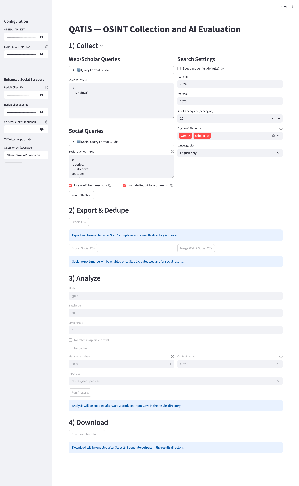

# QATIS

Turnkey OSINT collection and AI-assisted evaluation. Collect from web, academic, and optional social sources; export, dedupe, and score with an LLM; review structured outputs.

## Screenshot



## Features

- Multi-source collection: Google (via ScraperAPI), OpenAlex (academic), optional social (YouTube, Reddit, VK)
- AI evaluation: intel/non-intel, confidence, rationale, PMESII tags, Admiralty codes
- Outputs: CSVs, PMESII markdown summary, BibTeX
- Interfaces: Streamlit GUI and CLI

## Requirements

- Python 3.11+ for GUI (CLI works on newer Python but GUI is tested on 3.11)
- Keys: `OPENAI_API_KEY`, `SCRAPERAPI_API_KEY` (trial available)
- Optional social credentials: Reddit, VK

## Installation

Recommended (macOS):
```bash
brew install python@3.11
cd /Users/emilwl/Documents/QATIS
/opt/homebrew/bin/python3.11 -m venv .venv
source .venv/bin/activate
pip install -e .
pip install -e '.[ui]'
```

CLI-only (newer Python):
```bash
pip install -e . --break-system-packages
```

## Configure keys
```bash
qatis configure
# Provide OPENAI_API_KEY and SCRAPERAPI_API_KEY
```

## Run (GUI)
```bash
./start_ui.sh
# or
qatis ui
# Opens at http://localhost:8501
```

## Run (CLI)
```bash
# One-shot pipeline
qatis run-all --queries queries.yaml --top-k 10

# Or step-by-step
qatis collect --queries queries.yaml --top-k 20
qatis export --results-dir search_results/<timestamp>
qatis analyze --results-dir search_results/<timestamp>
```

## Example queries
```yaml
areas:
  - 'Moldova infrastructure 2024'
structures:
  - 'Moldelectrica ownership filetype:pdf'
```
Optional social:
```yaml
youtube:
  queries:
    - 'Moldova energy 2024'
reddit:
  subreddits:
    - 'europe'
  queries:
    - 'Moldova infrastructure'
```

## Outputs

- `results_scored.csv` — All sources with labels, confidence, PMESII, Admiralty, rationale
- `results_scored_intel.csv` / `results_scored_non_intel.csv`
- `pmesii_infrastructure.md` — PMESII-organized summary
- `intel_sources.bib` — BibTeX of intel sources
- `analysis_cache.jsonl` — Cache to avoid re-analyzing

## Project structure
```text
qatis/
  collect/        # collectors for web/social
  analyze/        # analysis pipeline
  export/         # exporters
  ui_app.py       # Streamlit GUI
start_ui.sh       # GUI launcher
queries.yaml      # example queries
search_results/   # outputs by timestamp
```

## Troubleshooting

- Missing keys: run `qatis configure`
- UI won’t start on Python 3.14: use Python 3.11
- Empty results: check ScraperAPI balance, simplify queries
- Social scraping failures: ensure optional deps, note that X/Twitter is often blocked

## License

MIT
